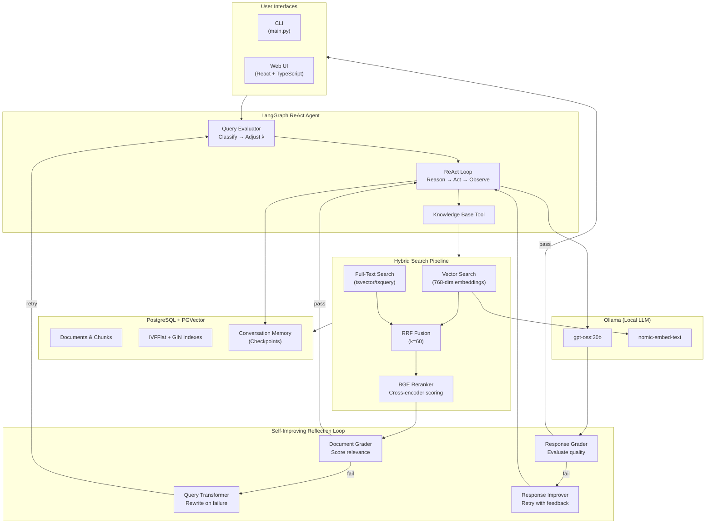
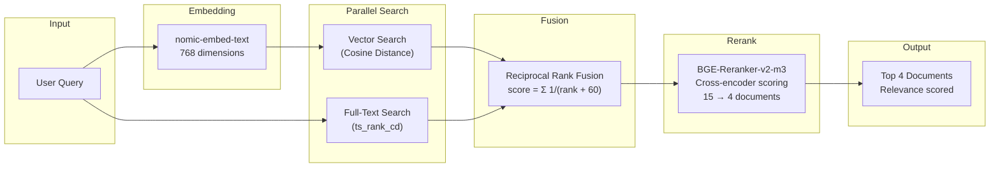
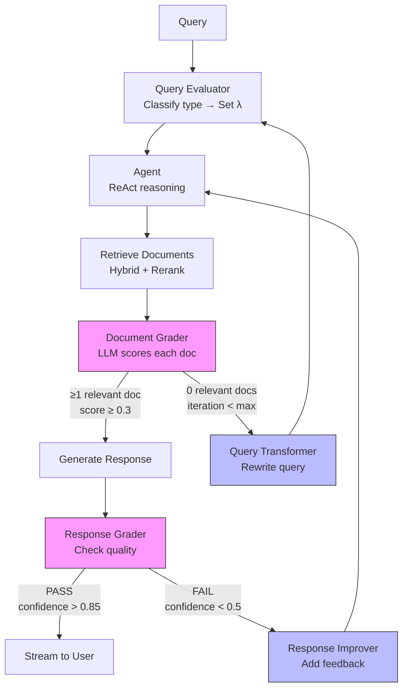

# Rusty Compass

A production-grade, fully-local **LangGraph ReAct agent** with real-time streaming, hybrid search, and self-improving retrieval.

## Quick Links

- **[Setup Guide](langchain_agent/SETUP.md)** - Complete setup from scratch (single `python setup.py` command)
- **[User Guide](langchain_agent/README.md)** - How to use the agent and customize behavior
- **[Developer Guide](langchain_agent/DEVELOPER.md)** - Architecture, components, and extending the system

## What is It?

A fully local RAG (Retrieval-Augmented Generation) agent that combines:

- **LangGraph ReAct Agent** - Graph-based state machine orchestration with reasoning
- **Hybrid Search** - Vector + full-text search with Reciprocal Rank Fusion (RRF)
- **Cross-Encoder Reranking** - BGE reranker for improved relevance scoring
- **Self-Improving Reflection Loop** - Document grading, query transformation, response grading
- **Persistent Memory** - PostgreSQL-backed conversation history with context compaction
- **Real-Time Streaming** - Character-by-character output via WebSocket/CLI
- **100% Local** - No external API calls, complete privacy

## Architecture

### System Overview



### Hybrid Search & Reranking Pipeline



### Reflection Loop (Self-Improvement)



## Tech Stack

| Category             | Technology                        | Purpose                                 |
| -------------------- | --------------------------------- | --------------------------------------- |
| **LLM**              | Ollama + gpt-oss:20b              | Local reasoning engine (20B parameters) |
| **Embeddings**       | nomic-embed-text                  | 768-dimensional semantic vectors        |
| **Reranker**         | BAAI/bge-reranker-v2-m3           | Cross-encoder relevance scoring         |
| **Agent Framework**  | LangGraph + LangChain             | Graph-based state machine orchestration |
| **Vector Database**  | PostgreSQL + PGVector             | Semantic search with IVFFlat indexing   |
| **Full-Text Search** | PostgreSQL (tsvector)             | Keyword search with GIN indexing        |
| **Memory**           | PostgreSQL + langgraph-checkpoint | Persistent conversation state           |
| **Backend API**      | FastAPI + WebSocket               | REST API with real-time streaming       |
| **Frontend**         | React 18 + TypeScript + Tailwind  | Modern web UI with Zustand state        |
| **Containerization** | Docker Compose                    | PostgreSQL orchestration                |

## Key Techniques

| Technique | Description |
| --- | --- |
| **Reciprocal Rank Fusion (RRF)** | Combines vector and full-text search rankings: `score = Σ 1/(rank + k)` where k=60 |
| **Cross-Encoder Reranking** | BGE model directly scores query-document relevance (0.0-1.0) |
| **Adaptive Lambda** | Dynamically adjusts vector vs. lexical weight based on query type |
| **Document Grading** | LLM evaluates each retrieved document's relevance |
| **Query Transformation** | Rewrites failed queries for better retrieval |
| **Response Grading** | Evaluates response quality (relevance, completeness, clarity) |
| **Context Compaction** | Summarizes older messages when conversation exceeds token limits |
| **Confidence-Based Early Stopping** | Skips retries when >85% confident, forces retry when <50% |

## Setup (3 Steps)

```bash
# 1. Start PostgreSQL
docker compose up -d

# 2. Run unified setup (choose your knowledge base)
cd langchain_agent

# Option A: Use LangChain/LangGraph/LangSmith documentation (recommended)
python setup.py --docs-source langchain

# Option B: Use sample documents (for quick testing)
python setup.py

# 3. Run the agent
python main.py
```

That's it! The `setup.py` script handles:

- Database initialization
- PGVector extension setup
- Vector indexes & full-text search
- Ollama model pulling (LLM, embeddings, reranker)
- Document loading with embeddings

### LangChain Documentation Knowledge Base

The agent can be configured with official LangChain documentation as its knowledge base:

```bash
# Full setup with LangChain docs
python setup.py --docs-source langchain

# Or run ingestion separately
python ingest_langchain_docs.py

# Update to latest docs
python ingest_langchain_docs.py --update

# Check current stats
python ingest_langchain_docs.py --stats
```

This ingests **~2,000 documents** from:

- **LangChain** - Core framework documentation
- **LangGraph** - Graph-based agent orchestration
- **LangSmith** - Observability and tracing platform

## Features

- **Automated Setup** - Single command initialization (`python setup.py`)
- **Real-Time Streaming** - Token-by-token output via WebSocket/CLI
- **Hybrid Search** - Vector + full-text with RRF fusion
- **Cross-Encoder Reranking** - BGE reranker scores document relevance
- **Reflection Loop** - Document grading, query transformation, response grading
- **Query Evaluation** - Dynamic lambda adjustment based on query type
- **Persistent Memory** - Multi-turn conversations with context compaction
- **Conversation Management** - Create, list, load, clear conversations
- **Web UI** - React frontend with real-time graph visualization
- **CLI** - Interactive command-line interface
- **Local Only** - All data stays on your machine
- **Fully Documented** - Setup, User, and Developer guides included  

## Example Queries

With LangChain documentation knowledge base:

```text
You: What is LangGraph?
[Reranker] Reranking 15 candidates → top 4 selected
Agent (response): LangGraph is a library for building stateful, multi-actor applications...

You: How do I create a ReAct agent in LangChain?
Agent (response): To create a ReAct agent, you can use create_react_agent()...
```

With sample documents:

```text
You: What is Python programming?
Agent (response): Python is a high-level programming language...
```

## Documentation

### For Users

- **[README](langchain_agent/README.md)** - Features, usage, commands, troubleshooting
- **[SETUP](langchain_agent/SETUP.md)** - Installation and configuration

### For Developers

- **[DEVELOPER](langchain_agent/DEVELOPER.md)** - Architecture, components, extending

## Directory Structure

```text
rusty-compass/
├── README.md                     # This file (project overview)
├── docker-compose.yml            # PostgreSQL + PGVector setup
├── sample_docs/                  # Sample knowledge base documents
│   ├── python_basics.txt
│   ├── machine_learning_intro.txt
│   └── web_development.txt
├── langchain_agent/              # Backend application
│   ├── setup.py                  # Unified setup (ONE COMMAND)
│   ├── main.py                   # Agent entry point (CLI)
│   ├── config.py                 # Configuration constants
│   ├── ingest_langchain_docs.py  # LangChain docs ingestion
│   ├── requirements.txt          # Python dependencies
│   ├── README.md                 # User guide
│   ├── SETUP.md                  # Setup guide
│   ├── DEVELOPER.md              # Developer guide
│   └── test_*.py                 # Test suites
└── web/                          # Frontend application
    ├── src/
    │   ├── components/           # React components
    │   ├── stores/               # Zustand state management
    │   └── App.tsx               # Main application
    ├── package.json              # Node dependencies
    └── vite.config.ts            # Vite build configuration
```

## Performance

| Operation | Time |
| --------- | ---- |
| First query | 15-30s (model loading) |
| Subsequent queries | 6-32s (search + reasoning) |
| Vector search | ~600ms |
| Reranking (15 docs) | ~1-2s |
| LLM response | 5-30s |

## Getting Started

1. **Read**: [SETUP.md](langchain_agent/SETUP.md) - 10 minutes
2. **Run**: `python setup.py` - 10-40 minutes (first run)
3. **Use**: `python main.py` - Start chatting!

For more details, see [README.md](langchain_agent/README.md).

---

**Status**: Production Ready
**Last Updated**: 2025-12-29
