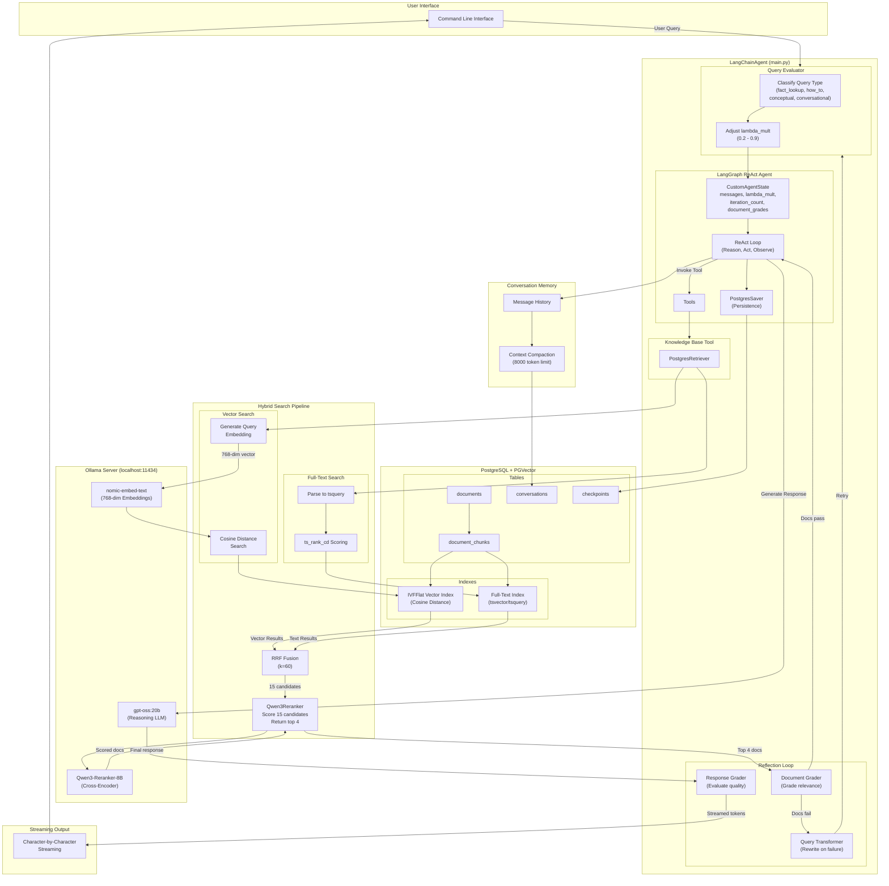

# Rusty Compass

A production-grade LangGraph ReAct agent with real-time streaming, local knowledge base, and persistent memory.

## Quick Links

- **[Setup Guide](langchain_agent/SETUP.md)** - Complete setup from scratch (single `python setup.py` command)
- **[User Guide](langchain_agent/README.md)** - How to use the agent and customize behavior
- **[Developer Guide](langchain_agent/DEVELOPER.md)** - Architecture, components, and extending the system

## What is It?

A fully local LangChain agent that combines:

- **🧠 Intelligent Reasoning**: Streams thinking process and responses
- **📚 Semantic Search**: Local PostgreSQL + PGVector knowledge base
- **💾 Persistent Memory**: Conversation history with multi-turn context
- **🔒 Complete Privacy**: No external API calls or cloud dependencies
- **⚡ Real-Time Streaming**: Character-by-character output

## Architecture



## Tech Stack

| Component           | Technology                      |
| ------------------- | ------------------------------- |
| **LLM**             | Ollama + gpt-oss:20b            |
| **Embeddings**      | Ollama + nomic-embed-text       |
| **Reranker**        | Qwen3-Reranker-8B (HuggingFace) |
| **Vector Store**    | PostgreSQL + PGVector           |
| **Agent Framework** | LangGraph                       |
| **Memory**          | PostgreSQL                      |

## Setup (3 Steps)

```bash
# 1. Start PostgreSQL
docker compose up -d

# 2. Run unified setup (choose your knowledge base)
cd langchain_agent

# Option A: Use LangChain/LangGraph/LangSmith documentation (recommended)
python setup.py --docs-source langchain

# Option B: Use sample documents (for quick testing)
python setup.py

# 3. Run the agent
python main.py
```

That's it! The `setup.py` script handles:

- Database initialization
- PGVector extension setup
- Vector indexes & full-text search
- Ollama model pulling (LLM, embeddings, reranker)
- Document loading with embeddings

### LangChain Documentation Knowledge Base

The agent can be configured with official LangChain documentation as its knowledge base:

```bash
# Full setup with LangChain docs
python setup.py --docs-source langchain

# Or run ingestion separately
python ingest_langchain_docs.py

# Update to latest docs
python ingest_langchain_docs.py --update

# Check current stats
python ingest_langchain_docs.py --stats
```

This ingests **~2,000 documents** from:
- **LangChain** - Core framework documentation
- **LangGraph** - Graph-based agent orchestration
- **LangSmith** - Observability and tracing platform

## Features

✅ **7-Step Setup** - Automated initialization (`python setup.py`)
✅ **Real-Time Streaming** - Thinking + responses stream character-by-character
✅ **Hybrid Search** - Vector + full-text with RRF fusion
✅ **Cross-Encoder Reranking** - Qwen3-Reranker-8B scores document relevance
✅ **Reflection Loop** - Document grading, query transformation, response grading
✅ **Query Evaluation** - Dynamic lambda adjustment based on query type
✅ **Persistent Memory** - Multi-turn conversations with context preservation
✅ **Conversation Management** - Create, list, load, clear conversations
✅ **Local Only** - All data stays on your machine
✅ **Fully Documented** - Setup, User, and Developer guides included  

## Example Queries

With LangChain documentation knowledge base:
```text
You: What is LangGraph?
[Reranker] Reranking 15 candidates → top 4 selected
Agent (response): LangGraph is a library for building stateful, multi-actor applications...

You: How do I create a ReAct agent in LangChain?
Agent (response): To create a ReAct agent, you can use create_react_agent()...
```

With sample documents:
```text
You: What is Python programming?
Agent (response): Python is a high-level programming language...
```

## Documentation

### For Users

- **[README](langchain_agent/README.md)** - Features, usage, commands, troubleshooting
- **[SETUP](langchain_agent/SETUP.md)** - Installation and configuration

### For Developers

- **[DEVELOPER](langchain_agent/DEVELOPER.md)** - Architecture, components, extending

## Directory Structure

```text
rusty-compass/
├── README.md                  # This file
├── docker-compose.yml         # PostgreSQL + PGVector setup
├── sample_docs/               # Sample knowledge base documents (optional)
│   ├── python_basics.txt
│   ├── machine_learning_intro.txt
│   └── web_development.txt
└── langchain_agent/           # Main application
    ├── setup.py               # Unified setup (ONE COMMAND)
    ├── ingest_langchain_docs.py  # LangChain docs ingestion
    ├── main.py                # Agent entry point
    ├── config.py              # Configuration
    ├── requirements.txt       # Dependencies
    ├── README.md              # User guide
    ├── SETUP.md               # Setup guide
    ├── DEVELOPER.md           # Developer guide
    └── test_*.py              # Test suites
```

## Performance

| Operation | Time |
| --------- | ---- |
| First query | 15-30s (model loading) |
| Subsequent queries | 6-32s (search + reasoning) |
| Vector search | ~600ms |
| Reranking (15 docs) | ~1-2s |
| LLM response | 5-30s |

## Getting Started

1. **Read**: [SETUP.md](langchain_agent/SETUP.md) - 10 minutes
2. **Run**: `python setup.py` - 10-40 minutes (first run)
3. **Use**: `python main.py` - Start chatting!

For more details, see [README.md](langchain_agent/README.md).

---

**Status**: Production Ready ✓
**Last Updated**: 2025-12-28
