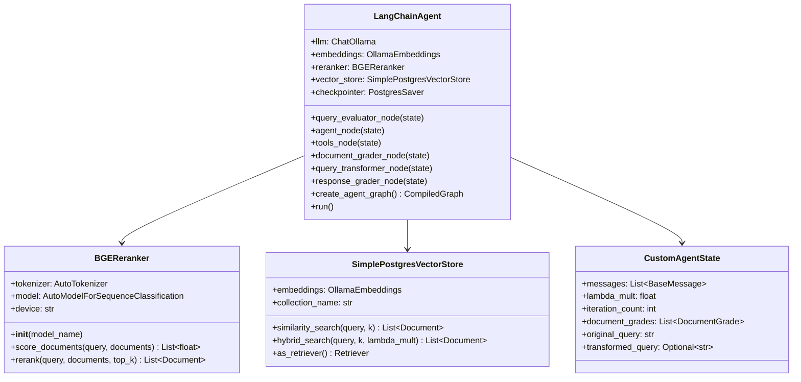
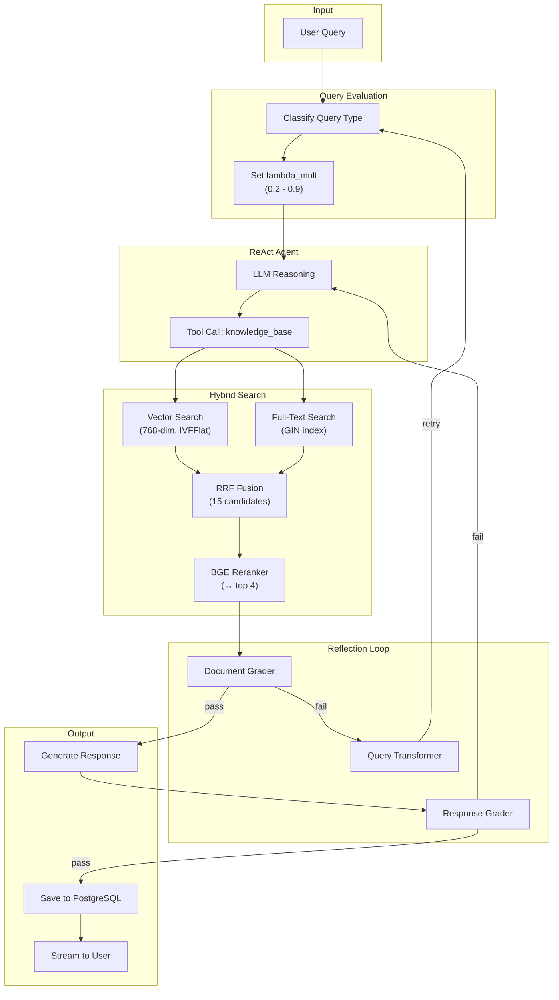
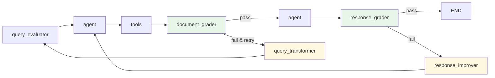

# Developer Guide

Information for developers extending or modifying the LangChain Agent.

## Architecture

### Core Components



### Data Flow



## Key Files

| File | Lines | Purpose |
|------|-------|---------|
| main.py | 1800+ | Core agent with reflection loop |
| setup.py | 500 | Complete initialization |
| config.py | 260 | Configuration constants |
| test_reranker.py | 400 | Reranker unit tests (6 tests) |
| test_hybrid_search.py | 160 | Search strategy validation |
| test_query_evaluator.py | 200 | Query classification tests |
| test_reflection.py | 360 | Reflection loop tests (6 tests) |

## Testing

### Run All Tests

```bash
# Reranker tests (most important)
python test_reranker.py
# Expected: 6/6 passing

# Hybrid search tests
python test_hybrid_search.py
# Shows different lambda_mult effects

# Query evaluator tests
python test_query_evaluator.py
# Validates query classification

# Reflection loop tests
python test_reflection.py
# Expected: 6/6 passing
```

### Test Coverage

**test_reranker.py**:
- ✓ ML query reranking
- ✓ Programming query reranking
- ✓ Score range validation (0.0-1.0)
- ✓ Relevance ordering (descending)
- ✓ Performance benchmarking
- ✓ Edge cases (empty, single doc, top_k > count)

**test_hybrid_search.py**:
- λ=0.0: Pure lexical (full-text keywords)
- λ=0.25: 75% lexical + 25% semantic (default)
- λ=0.5: Balanced hybrid
- λ=1.0: Pure semantic (vector embeddings)

**test_query_evaluator.py**:
- Factual queries → low lambda (0.1-0.3)
- Version-specific → medium (0.3-0.5)
- Conceptual → high lambda (0.8-1.0)

**test_reflection.py**:
- ✓ Configuration loading
- ✓ State type definitions (DocumentGrade, ReflectionResult)
- ✓ Graph creation with reflection nodes
- ✓ Document grader logic (relevant/irrelevant classification)
- ✓ Response grader logic (pass/fail with score)
- ✓ Query transformer logic (rewrite on failure)

## Component Details

### BGEReranker

**Model**: `BAAI/bge-reranker-v2-m3` from HuggingFace

**How it works**:
1. Load cross-encoder model using AutoModelForSequenceClassification
2. Format input as query-document pairs
3. Get relevance score from model output
4. Return scores in [0.0, 1.0] range

**Key code**:
```python
class BGEReranker:
    def __init__(self, model_name="BAAI/bge-reranker-v2-m3"):
        self.tokenizer = AutoTokenizer.from_pretrained(model_name)
        self.model = AutoModelForSequenceClassification.from_pretrained(model_name)
        self.device = "cuda" if torch.cuda.is_available() else "cpu"
```

**Why this works**:
- Cross-encoder directly evaluates query-document relevance
- Pre-trained on huge corpus of relevance judgments
- Compact size (~2.3GB) with good accuracy
- Multilingual support (100+ languages)

### Hybrid Search

**Algorithm**: Reciprocal Rank Fusion (RRF)

```
For each document:
    rrf_score = sum of (1 / (rank_in_vector + k)) and (1 / (rank_in_text + k))
    where k=60 (constant to prevent division by zero)
```

**RRF Benefits**:
- Combines different ranking signals
- Robust to individual signal failures
- No need to normalize scores across modalities
- Proven effective for retrieval

**Lambda Parameter**:
```python
# 0.0: Pure lexical (text keywords)
lambda_mult = 0.0
vector_weight = 0.0
text_weight = 1.0

# 0.25: Default (75% text, 25% vector)
lambda_mult = 0.25
vector_weight = 0.25
text_weight = 0.75

# 1.0: Pure semantic (vector embeddings)
lambda_mult = 1.0
vector_weight = 1.0
text_weight = 0.0
```

### Query Evaluator

**Purpose**: Dynamically adjust `lambda_mult` based on query type

**Classification**:
```
Factual/Lexical queries (low lambda: 0.1-0.3)
- Product specifications
- Dates and version numbers
- Exact names

Balanced queries (medium lambda: 0.3-0.7)
- Framework comparisons
- How-to guides
- Tutorial recommendations

Conceptual queries (high lambda: 0.7-1.0)
- "What is X?" (definitions)
- "Explain Y" (concepts)
- "How does Z work?" (mechanisms)
```

**Implementation**:
```python
def evaluate_query(query: str, llm) -> float:
    # Ask LLM to classify query type
    classification = llm.invoke(f"Classify: {query}")
    # Map classification → lambda value
    return lambda_mapping[classification]
```

### Reflection Loop

**Purpose**: Self-improving agent that grades documents and responses

**Graph Flow**:



**Components**:

1. **Document Grader** (`document_grader_node`):
   - Evaluates each retrieved document for relevance
   - Uses LLM to score (0.0-1.0) and classify (relevant/irrelevant)
   - Pass criteria: ≥2 relevant docs AND avg score ≥0.5
   ```python
   # For each document:
   prompt = f"Evaluate if this document is relevant to: {query}\n{doc}"
   result = llm.invoke(prompt)  # Returns JSON with score and reasoning
   ```

2. **Query Transformer** (`query_transformer_node`):
   - Rewrites failed queries for better retrieval
   - Uses failed document reasons to improve query
   - Triggers only when docs fail AND iteration < max
   ```python
   prompt = f"Rewrite query for better results:\n{query}\nFailed because: {reasons}"
   new_query = llm.invoke(prompt)
   ```

3. **Response Grader** (`response_grader_node`):
   - Evaluates final response quality
   - Checks relevance, completeness, clarity
   - Returns pass/fail with score and reasoning
   ```python
   prompt = f"Evaluate response quality for: {query}\nResponse: {response}"
   result = llm.invoke(prompt)  # Returns JSON with grade and score
   ```

**State Fields**:
```python
class CustomAgentState(TypedDict):
    # ... existing fields ...
    iteration_count: int              # 0, 1, or 2 (max iterations)
    retrieved_documents: List[Document]
    document_grades: List[DocumentGrade]
    document_grade_summary: ReflectionResult
    response_grade: ReflectionResult
    original_query: str               # Preserved for transformation
    transformed_query: Optional[str]  # Rewritten query
```

**Configuration**:
```python
ENABLE_REFLECTION = True              # Master switch
ENABLE_DOCUMENT_GRADING = True        # Grade retrieved docs
ENABLE_RESPONSE_GRADING = True        # Evaluate response quality
ENABLE_QUERY_TRANSFORMATION = True    # Rewrite on failure
REFLECTION_MAX_ITERATIONS = 2         # Max retry attempts
REFLECTION_MIN_RELEVANT_DOCS = 2      # Docs needed to pass
REFLECTION_DOC_SCORE_THRESHOLD = 0.5  # Min average score
REFLECTION_SHOW_STATUS = True         # Console output
```

**Performance Impact**:
- Document grading: ~2-4s (LLM evaluates each doc)
- Response grading: ~1-2s
- Query transformation: ~1-2s (when triggered)
- Worst case (retry): ~10s additional

## Performance Optimization

### Current Optimizations

1. **Connection Pooling**:
   - Reuse PostgreSQL connections (max_size=20)
   - Reduce connection overhead from 200ms → 25ms

2. **Batch Embeddings**:
   - Generate embeddings for all chunks at once
   - 5-10× faster than sequential embedding
   - Implemented in setup.py and load_sample_data

3. **IVFFlat Index**:
   - Fast approximate vector search
   - Trades some accuracy for speed
   - lists=100 (optimal for 768-dim vectors)

4. **GIN Full-Text Index**:
   - O(log n) lookup for keyword search
   - Pre-computed tsvector column

### Future Optimization Opportunities

1. **Caching**:
   ```python
   # Cache embeddings for frequently asked questions
   embedding_cache = {}

   def get_embedding(text):
       if text in embedding_cache:
           return embedding_cache[text]
       embedding = embeddings.embed_query(text)
       embedding_cache[text] = embedding
       return embedding
   ```

2. **Batched Reranking**:
   ```python
   # Score multiple documents in parallel (if GPU available)
   def rerank_batch(query, docs, batch_size=16):
       for i in range(0, len(docs), batch_size):
           batch = docs[i:i+batch_size]
           # Batch tokenization
           tokens = tokenizer([query]*len(batch), batch)
           # Batch inference
           logits = model(**tokens).logits
   ```

3. **Query Optimization**:
   ```python
   # Rewrite query for better search
   def optimize_query(query):
       # Remove stop words
       # Expand abbreviations
       # Correct spelling
       return optimized_query
   ```

4. **Retrieval Augmentation**:
   ```python
   # Iteratively expand retrieval
   initial_docs = hybrid_search(query, k=4)
   expanded_query = expand_with_context(query, initial_docs)
   final_docs = hybrid_search(expanded_query, k=8)
   ```

## Extending the Agent

### Add a New Tool

```python
# In main.py, add new tool function
from langchain_core.tools import tool

@tool
def my_custom_tool(input: str) -> str:
    """Description of what this tool does"""
    # Implementation
    return result

# Register tool
tools = [knowledge_base, my_custom_tool]
```

### Change LLM Model

```python
# In config.py
LLM_MODEL = "llama2:13b"  # or any Ollama model
```

### Change Reranker

```python
# In config.py
RERANKER_MODEL = "BAAI/bge-reranker-v2-m3"  # Default (~2.3GB)
RERANKER_MODEL = "BAAI/bge-reranker-v2-large"  # Larger, more accurate

# In config.py - make reranking optional
ENABLE_RERANKING = False  # Disable for speed
```

### Add Conversational Memory Features

```python
# In LangChainAgent.tools_node
# Track user preferences
# Maintain context across turns
# Summarize long conversations
```

### Implement Caching

```python
# Cache embeddings
from functools import lru_cache

@lru_cache(maxsize=1000)
def cached_embed(text):
    return embeddings.embed_query(text)
```

## Common Issues & Solutions

### Reranker Scores All Same

**Cause**: Model output format mismatch

**Fix**: Check model output in debug script:
```bash
python -c "
from transformers import AutoModel, AutoTokenizer
import torch
model_name = 'BAAI/bge-reranker-v2-m3'
tokenizer = AutoTokenizer.from_pretrained(model_name, trust_remote_code=True)
model = AutoModel.from_pretrained(model_name, trust_remote_code=True)
# Check outputs.logits shape and values
"
```

### Hybrid Search Not Working

**Cause**: Full-text index not created

**Fix**: Re-run setup:
```bash
python setup.py
# Verify: SELECT * FROM pg_indexes WHERE tablename = 'document_chunks'
```

### Slow Queries

**Cause**: Large number of candidates, slow reranker

**Options**:
```python
# Reduce candidates
RERANKER_FETCH_K = 10  # was 15

# Disable reranking
ENABLE_RERANKING = False

# Use smaller reranker
RERANKER_MODEL = "BAAI/bge-reranker-v2-m3"
```

### High Memory Usage

**Cause**: Large models consuming GPU memory

**Solutions**:
```python
# Disable reranking
ENABLE_RERANKING = False

# Use CPU instead of GPU (slower but less memory)
# Already auto-detected: device = "cuda" or "cpu"
```

## Code Style

### Python Standards
- PEP 8 compliant
- Type hints on public methods
- Comprehensive docstrings
- 80-100 character line length

### Documentation
- Module docstrings (at top of file)
- Function docstrings (args, returns, raises)
- Inline comments for complex logic
- Example usage in docstrings

### Testing
- Unit tests in test_*.py
- Each test is independent
- Setup/teardown as needed
- Clear assertion messages

## Contributing

### Pull Request Process

1. Create feature branch
2. Make changes with tests
3. Verify all tests pass
4. Update documentation
5. Commit with clear message
6. Push and create PR

### Commit Messages

```
[Feature] Add new component
Clear description of changes
- Bullet point 1
- Bullet point 2

Related: issue #123
```

## Monitoring & Debugging

### Enable Debug Logging

```python
import logging
logging.basicConfig(level=logging.DEBUG)
logger = logging.getLogger(__name__)

logger.debug(f"[Reranker] Score: {score:.4f}")
logger.info(f"[Hybrid] Found {len(results)} candidates")
logger.warning(f"[Query] Evaluation timeout")
logger.error(f"[Database] Connection failed: {e}")
```

### Profile Queries

```python
import time

# Measure hybrid search
start = time.time()
results = vector_store.hybrid_search(query, k=15)
hybrid_time = time.time() - start

# Measure reranking
start = time.time()
reranked = reranker.rerank(query, results, top_k=4)
rerank_time = time.time() - start

print(f"Hybrid: {hybrid_time*1000:.1f}ms")
print(f"Rerank: {rerank_time*1000:.1f}ms")
```

### Database Inspection

```bash
# Connect to DB
psql -h localhost -U postgres -d langchain_agent

# Check tables
\dt  # list tables
\di  # list indexes

# Sample data
SELECT * FROM documents LIMIT 1;
SELECT COUNT(*) FROM document_chunks;
SELECT COUNT(*) FROM conversation_metadata;

# Check index performance
EXPLAIN ANALYZE SELECT * FROM document_chunks WHERE embedding <-> $1 LIMIT 4;
```

## Resources

- **LangGraph**: https://langchain-ai.github.io/langgraph/
- **LangChain**: https://python.langchain.com/
- **BGE Reranker**: https://huggingface.co/BAAI/bge-reranker-v2-m3
- **PGVector**: https://github.com/pgvector/pgvector
- **Ollama**: https://ollama.com/

